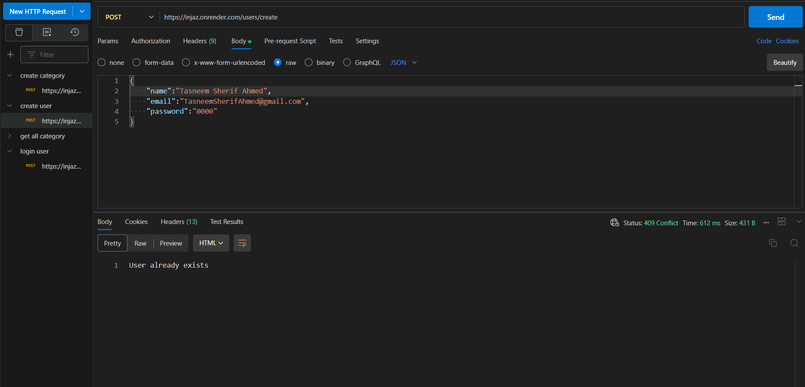
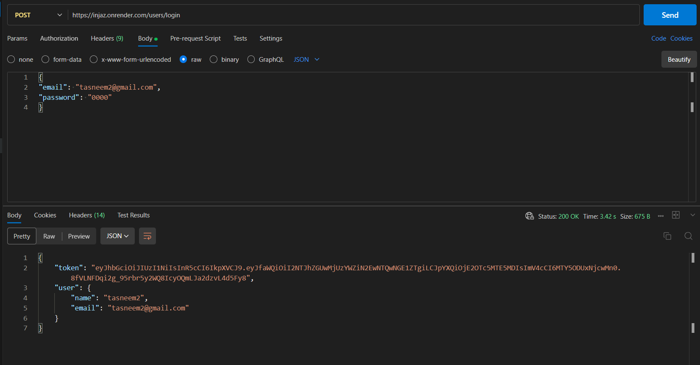
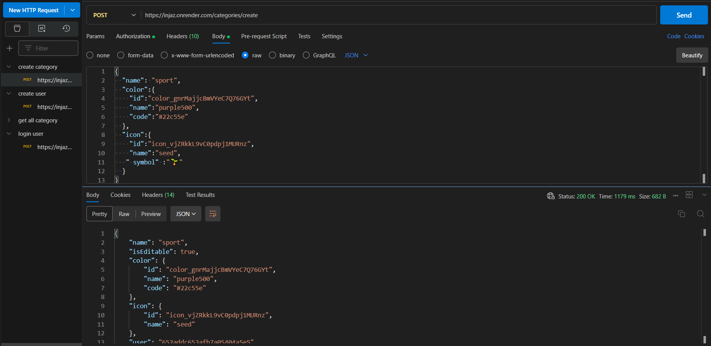

# Injaz-App-Back-end
# To-Do List API

A powerful and customizable To-Do List API built with TypeScript, Express.js, and Mongoose.

## Table of Contents

- [Project Overview](#project-overview)
- [Features](#features)
- [Prerequisites](#prerequisites)
- [Getting Started](#getting-started)
  - [Installation](#installation)
  - [Configuration](#configuration)
- [API Endpoints](#api-endpoints)
- [Postman Testing](#postman-testing)


## Project Overview

The To-Do List API is a robust backend for managing tasks and categories in a To-Do List application. It offers user management, task management, and category management features, providing a solid foundation for building your own To-Do List application.

## Features

- **User Management**:
  - User Registration
  - User login
  - Account management

- **Task Management**:
  - Create tasks
  - Update tasks
  - Delete tasks
  - Mark tasks as complete

- **Category Management**:
  - Create categories
  - Update categories
  - Delete categories
  - Associate tasks with categories

- **TypeScript**: Ensures code type safety and quality.

- **Express.js**: Efficient routing and middleware for the API.

- **Mongoose**: MongoDB integration for seamless database operations.

- **Postman Testing**: Included test scripts for API functionality and reliability.

## Prerequisites

Before getting started, ensure you have the following dependencies:

- Node.js
- npm or yarn
- MongoDB

## Getting Started

Follow these steps to get the project up and running on your local machine:

### Installation

1. 🌀 Clone the repository:

   ```bash
   git clone https://github.com/yourusername/your-repo-name.git


2. Change into the project directory:
   ```bash
    your-repo-name


## Install dependencies:

    ```bash
       npm install
    
## Configuration:
Configure environment variables and create a .env file with the necessary settings, including database connection details and security settings.


## API Endpoints
there is an end point for users, tasks, categories
this is an example for creating a user, using "users/create"


## Postman Testing
you can test all the functionalty of the api using all end-points determined in the route file 
here is some examples of the test:
### log-in test:

### Create Category test:



 
